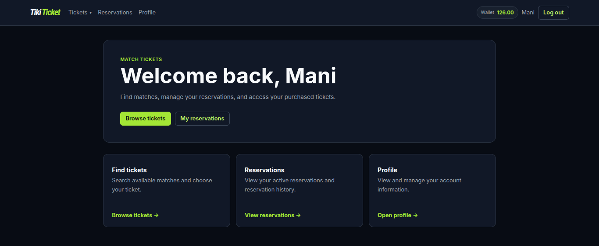
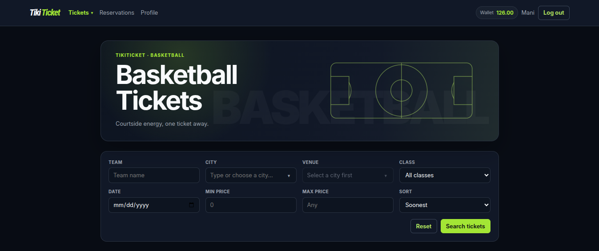
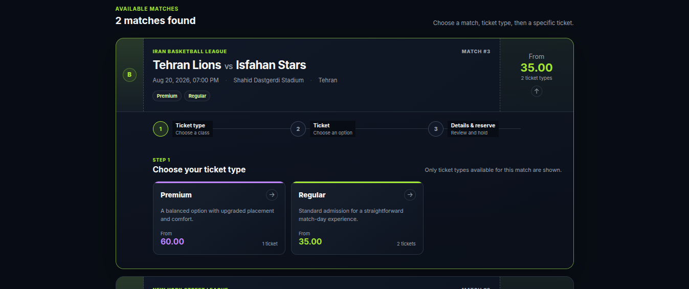
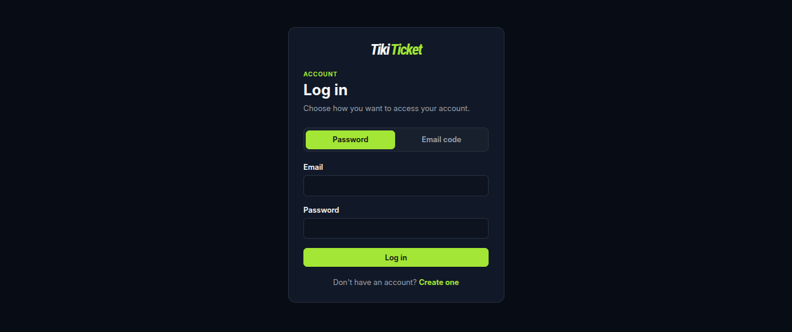
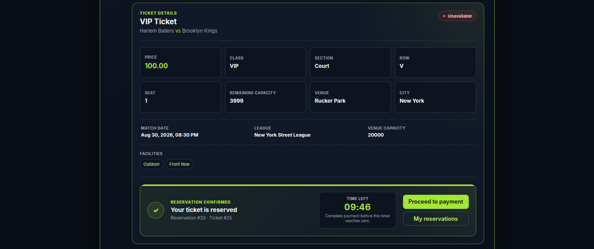
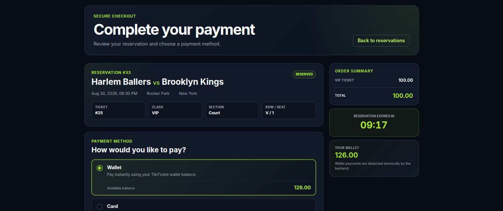
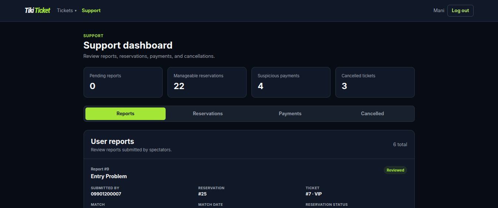
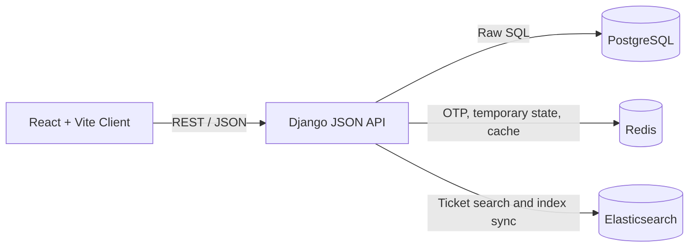
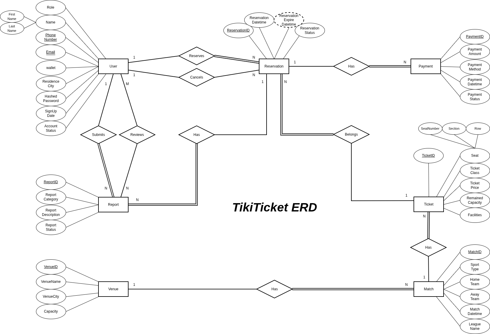
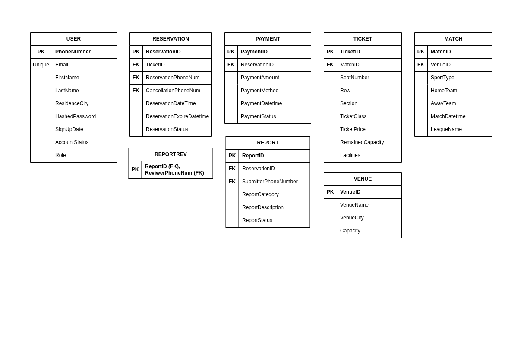

<div align="center">

# TikiTicket

**A full-stack sports ticket reservation and purchasing platform**

React · Django · PostgreSQL · Redis · Elasticsearch · Docker

[Overview](#overview) · [Architecture](#architecture) · [Getting Started](#getting-started) · [API Reference](#api-reference) · [Database](#database) · [Project Structure](#project-structure)

</div>

---

## Overview

TikiTicket is a sports ticketing platform for discovering matches, reserving seats, completing payments, managing bookings, handling cancellations and refunds, and reporting ticket-related issues.

<p align="center">
  
</p>

The project is designed as a complete database-backed application rather than a thin CRUD demo. PostgreSQL is the transactional source of truth, Redis is used for temporary and frequently accessed data, and Elasticsearch powers ticket search. The backend exposes a JSON API consumed by a React client, while the backend infrastructure can be started reproducibly with Docker Compose.

The system supports two application roles:

- **Spectator** — searches tickets, creates reservations, pays, views history, cancels purchases, receives wallet refunds, updates profile information, and submits reports.
- **Support** — reviews cancelled tickets, suspicious payments, reservations, and user reports, and can perform support-side reservation cancellation and report review.

## Features

### Ticket discovery

- Browse football, basketball, and volleyball tickets.
- Filter by sport, team, city, venue, date, ticket class, and price range.
- Sort by match date or ticket price.
- Search through Elasticsearch while keeping live availability synchronized with PostgreSQL.

<p align="center">
  
  
</p>

### Authentication and accounts

- Email/password login.
- Email OTP login.
- Two-step spectator signup with email verification.
- JWT-based authentication.

<p align="center">
  
</p>

### Reservations and payments

- Temporary ticket reservations with a 10-minute expiration window.
- Protection against duplicate, expired, sold-out, already purchased, and post-match reservations.
- Reservation history and purchased-ticket views.
- Local payment flow with `Card`, `Wallet`, and `Other` methods.
- Simulated card/other payment outcomes for development and demonstration.
- Cancellation quotes, cancellation rules, penalties, and wallet refunds.

<p align="center">
  
  
</p>

### Support workflow

- View cancelled tickets.
- Inspect suspicious payments.
- Review user reports.
- View manageable reservations.

<p align="center">
  
</p>


### Database deliverables

- Relational schema with primary keys, foreign keys, constraints, and indexes.
- Seed data covering users, venues, matches, tickets, reservations, payments, reports, and report reviews.
- **22 analytical SQL queries**.
- **8 PostgreSQL stored functions** for recurring and analytical operations.
- ER and relational-model diagrams included in `docs/`.

## Architecture



## Tech Stack

| Layer | Technology |
|---|---|
| Frontend | React 19, React Router, Vite 8 |
| Backend | Python 3.12, Django 5.2 |
| Relational database | PostgreSQL 17 |
| Cache / temporary storage | Redis 7 |
| Search | Elasticsearch 9.5 |
| Authentication | JWT, email OTP, hashed passwords |
| Infrastructure | Docker, Docker Compose |
| API testing | Postman collections, cURL |

> The backend intentionally uses **direct SQL rather than an ORM**. Django is used for the web layer and application infrastructure, while database operations are executed through parameterized SQL queries.

## Database

The relational model is centered around the following tables:

`Users` · `Venue` · `Matches` · `Ticket` · `Reservation` · `Payment` · `Report` · `ReportRev`

The schema defines referential constraints, domain checks, and indexes for common access paths such as sport, match date, venue city, ticket class, reservations, matches, and reports.

### ER diagram



<details>
<summary><strong>Relational model</strong></summary>

<br>



</details>

### SQL files

| File | Purpose |
|---|---|
| `database/00_reset.sql` | Drops existing project tables and stored functions |
| `database/01_schema.sql` | Creates the relational schema, constraints, and indexes |
| `database/02_insert_data.sql` | Inserts demonstration data |
| `database/03_queries.sql` | Contains the 22 required analytical/data-manipulation queries |
| `database/04_stored_procedures.sql` | Defines the 8 stored functions |
| `database/full_setup.sql` | Combined SQL bootstrap used by Docker initialization |

## Project Structure

```text
.
├── backend/
│   ├── config/                 # Django configuration
│   ├── core/
│   │   ├── api/                # API modules grouped by domain
│   │   ├── common/             # Database, Redis, Elasticsearch, JWT helpers
│   │   ├── management/         # Django management commands
│   │   └── search/             # Elasticsearch indexing/search/cache sync
│   ├── Dockerfile
│   ├── compose.yaml
│   ├── manage.py
│   └── requirements.txt
│
├── database/
│   ├── 00_reset.sql
│   ├── 01_schema.sql
│   ├── 02_insert_data.sql
│   ├── 03_queries.sql
│   ├── 04_stored_procedures.sql
│   └── full_setup.sql
│
├── docs/
│   ├── postman/                # API collections and test scenarios
│   ├── tiki-ticket-erd.*
│   └── tiki-ticket-relational-model.*
│
└── frontend/
    ├── src/
    │   ├── api/                # Client-side API wrappers
    │   ├── auth/               # Auth state and token storage
    │   ├── components/
    │   ├── layouts/
    │   ├── pages/
    │   └── styles/
    ├── package.json
    └── vite.config.js
```

## Getting Started

The recommended setup uses Docker for the backend services and Vite for the frontend.

### Prerequisites

- Docker with Docker Compose
- Node.js and npm
- An SMTP account only if you want to test email OTP/signup flows

### 1. Configure the backend

From the repository root:

```bash
cp backend/.env.example backend/.env
```

Open `backend/.env` and set at least the database and application secrets:

```env
DB_NAME=TikiTicketDB
DB_USER=postgres
DB_PASSWORD=change-me

DJANGO_SECRET_KEY=change-me
JWT_SECRET_KEY=change-me
```

For OTP signup/login, also configure the SMTP variables in the same file.

### 2. Start the backend stack

```bash
cd backend
docker compose up --build -d
```

This starts:

| Service | Local address |
|---|---|
| Django API | `http://localhost:8000/api/` |
| PostgreSQL | `localhost:5433` |
| Redis | `localhost:6379` |
| Elasticsearch | `http://localhost:9200` |

On the first PostgreSQL startup, the database is initialized from `database/full_setup.sql` through Docker's initialization mechanism.

### 3. Build the Elasticsearch ticket index

After the containers are healthy, index the PostgreSQL ticket data:

```bash
docker compose exec web python manage.py reindex_tickets
```

You should see a success message reporting how many tickets were indexed.

### 4. Start the frontend

In a second terminal:

```bash
cd frontend
npm ci
npm run dev
```

Open:

```text
http://localhost:5173
```

Vite proxies `/api` requests to the Django server on port `8000`, so no separate CORS configuration is required for the default local setup.

### Useful Docker commands

```bash
# Service status
docker compose ps

# Follow logs
docker compose logs -f

# Follow only backend logs
docker compose logs -f web

# Stop the stack
docker compose down
```

To remove the persisted Docker data and recreate the development environment from the SQL bootstrap:

```bash
docker compose down -v
docker compose up --build -d
docker compose exec web python manage.py reindex_tickets
```

## Demo Accounts

The seed data includes active spectator and support accounts that can be used with password login without configuring SMTP.

| Role | Email | Password |
|---|---|---|
| Spectator | `linus.torvalds@example.com` | `TestPassword123!` |
| Support | `alan.turing@example.com` | `SupportPassword123!` |

For OTP login or new account signup, configure the email settings in `backend/.env` first.

## Environment Configuration

The complete backend template is available in `backend/.env.example`.

| Variable group | Purpose |
|---|---|
| `DB_*` | PostgreSQL connection settings |
| `REDIS_*` | Redis host, port, and database |
| `ELASTICSEARCH_*` | Elasticsearch URL and ticket index name |
| `DJANGO_SECRET_KEY`, `DEBUG` | Django application configuration |
| `JWT_*` | JWT signing and access-token lifetime |
| `OTP_*` | OTP length, TTL, resend cooldown, and attempt limits |
| `EMAIL_*` | SMTP configuration for OTP delivery |

The frontend defaults to `/api`. If needed, override it with:

```bash
cp frontend/.env.example frontend/.env
```

```env
VITE_API_BASE_URL=/api
```

## API Reference

All authenticated endpoints expect:

```http
Authorization: Bearer <access_token>
```

### Authentication

| Method | Endpoint | Auth | Main input | Main output |
|---|---|---:|---|---|
| `POST` | `/api/auth/signup/` | No | `phone_number`, `email`, `first_name`, `last_name`, `password`, optional `residence_city` | Verification message, email, OTP expiry |
| `POST` | `/api/auth/signup/verify/` | No | `email`, `otp` | JWT access token and created user |
| `POST` | `/api/auth/login/` | No | `email`, `password` | JWT access token, expiry, public user data |
| `POST` | `/api/auth/login/otp/request/` | No | `email` | OTP delivery message and expiry |
| `POST` | `/api/auth/login/otp/verify/` | No | `email`, `otp` | JWT access token, expiry, public user data |

### Profile and locations

| Method | Endpoint | Auth | Main input | Main output |
|---|---|---:|---|---|
| `GET` | `/api/profile/` | Yes | Bearer token | Profile object including wallet balance |
| `PATCH` | `/api/profile/` | Yes | Any of `email`, `first_name`, `last_name`, `residence_city` | Updated profile object |
| `GET` | `/api/locations/cities/` | No | — | `count` and `cities` |
| `GET` | `/api/locations/venues/` | No | Optional `city` query parameter | `count` and `venues` |

### Tickets

| Method | Endpoint | Auth | Main input | Main output |
|---|---|---:|---|---|
| `GET` | `/api/tickets/` | No | Search/filter query parameters | `count` and matching ticket objects with live availability |
| `GET` | `/api/tickets/filter-options/` | No | Optional sport/city context | City/venue filter options |
| `GET` | `/api/tickets/<ticket_id>/` | No | Ticket ID in path | Detailed `ticket` object |

Supported ticket-search parameters:

```text
sport
team
city
venue
ticket_class
date
min_price
max_price
sort
```

Valid sort values are `date_asc`, `date_desc`, `price_asc`, and `price_desc`.

### Reservations, payments, and bookings

| Method | Endpoint | Auth | Main input | Main output |
|---|---|---:|---|---|
| `POST` | `/api/reservations/` | Spectator | `ticket_id` | Reservation object and expiry information |
| `GET` | `/api/reservations/user/` | Spectator | Bearer token | Active reservations, history, and counts |
| `GET` | `/api/reservations/<id>/cancellation-quote/` | Spectator | Reservation ID in path | Cancellation eligibility, penalty, and refund quote |
| `POST` | `/api/reservations/<id>/cancel/` | Spectator | Reservation ID in path | Cancellation result and refund information when applicable |
| `POST` | `/api/payments/` | Spectator | `reservation_id`, `payment_method`, and for Card/Other `simulate_result` | Payment status/result and updated reservation/payment data |
| `GET` | `/api/bookings/` | Spectator | Bearer token | Upcoming, cancelled, and used purchased tickets with counts |

Payment body example:

```json
{
  "reservation_id": 32,
  "payment_method": "Card",
  "simulate_result": "Success"
}
```

`simulate_result` is used for `Card` and `Other` payments. Wallet payments are determined from the user's actual stored wallet balance.

### Reports

| Method | Endpoint | Auth | Main input | Main output |
|---|---|---:|---|---|
| `POST` | `/api/reports/` | Spectator | `reservation_id`, `category`, `description` | Submission message and created report |

Example body:

```json
{
  "reservation_id": 17,
  "category": "Seat Issue",
  "description": "The seat information displayed on my ticket is incorrect."
}
```

### Support

| Method | Endpoint | Auth | Main input | Main output |
|---|---|---:|---|---|
| `GET` | `/api/support/cancelled-tickets/` | Support | Bearer token | `count` and cancelled ticket records |
| `GET` | `/api/support/suspicious-payments/` | Support | Bearer token | `count` and suspicious payment records |
| `GET` | `/api/support/reports/` | Support | Bearer token | `count` and submitted user reports |
| `GET` | `/api/support/reservations/` | Support | Bearer token | `count` and manageable reservations |
| `POST` | `/api/support/reservations/<id>/cancel/` | Support | Reservation ID in path | Support cancellation result |
| `POST` | `/api/support/reports/<id>/review/` | Support | Report ID in path | Review message and updated report |

## Example API Flow

### Login

```bash
curl -X POST http://localhost:8000/api/auth/login/ \
  -H "Content-Type: application/json" \
  -d '{
    "email": "linus.torvalds@example.com",
    "password": "TestPassword123!"
  }'
```

Copy the returned `access_token` and use it as a Bearer token.

### Search tickets

```bash
curl "http://localhost:8000/api/tickets/?sport=football&ticket_class=VIP&sort=price_asc"
```

### Reserve a ticket

```bash
curl -X POST http://localhost:8000/api/reservations/ \
  -H "Authorization: Bearer <access_token>" \
  -H "Content-Type: application/json" \
  -d '{"ticket_id": 13}'
```

### Complete a simulated card payment

```bash
curl -X POST http://localhost:8000/api/payments/ \
  -H "Authorization: Bearer <access_token>" \
  -H "Content-Type: application/json" \
  -d '{
    "reservation_id": <reservation_id>,
    "payment_method": "Card",
    "simulate_result": "Success"
  }'
```

## Postman Collections

Detailed request examples and success/failure scenarios are included under:

```text
docs/postman/
```

The collections cover authentication, signup, profile updates, location lookup, ticket search/details, reservation rules, payments, cancellation quotes, support operations, bookings, cancellations, and user reports.

They are useful for inspecting both successful responses and business-rule failures such as duplicate reservations, ownership checks, expired reservations, sold-out matches, repeated cancellations, and invalid payment states.

## Search, Cache, and Consistency

The project uses each data system for a specific purpose:

1. **PostgreSQL owns transactional state.** Reservation, payment, cancellation, report, profile, and wallet changes are committed here.
2. **Elasticsearch owns search-oriented ticket documents.** Ticket and match metadata is indexed for fast filtering and sorting.
3. **Redis stores short-lived or repeatedly requested data.** OTPs, pending signup information, search results, and location data use TTL-based Redis storage.
4. **Live ticket state is merged from PostgreSQL.** Cached/Elasticsearch search results do not independently decide whether a ticket is reserved, sold, or selectable.
5. **Search data is synchronized after committed writes.** Relevant Elasticsearch documents are refreshed after reservation/payment changes, and ticket-search caches are invalidated.

This keeps transactional correctness in the relational database while still demonstrating caching and dedicated search infrastructure.

## Development Notes

- The API returns JSON responses and uses explicit validation/error codes for business-rule failures.
- SQL statements are parameterized and organized by API domain.
- The reservation flow uses database transactions for state-changing operations.
- The frontend separates API wrappers, authentication state, route protection, pages, and reusable components.
- Spectator and support routes are protected independently according to the JWT role.
- Card/other payments are intentionally simulated locally; there is no external banking gateway dependency.

## Course Project Context

TikiTicket was developed as a project covering the full path from relational modeling and SQL design to backend APIs, caching, search infrastructure, a web client, and containerized backend services.

---